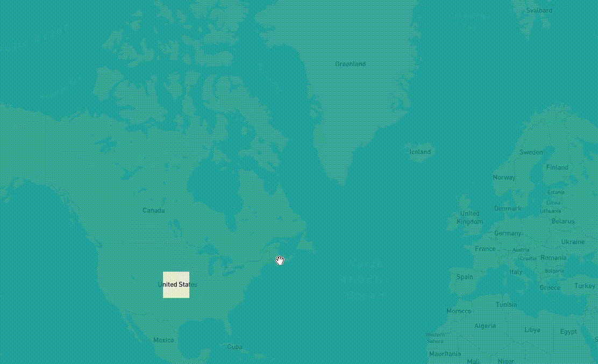
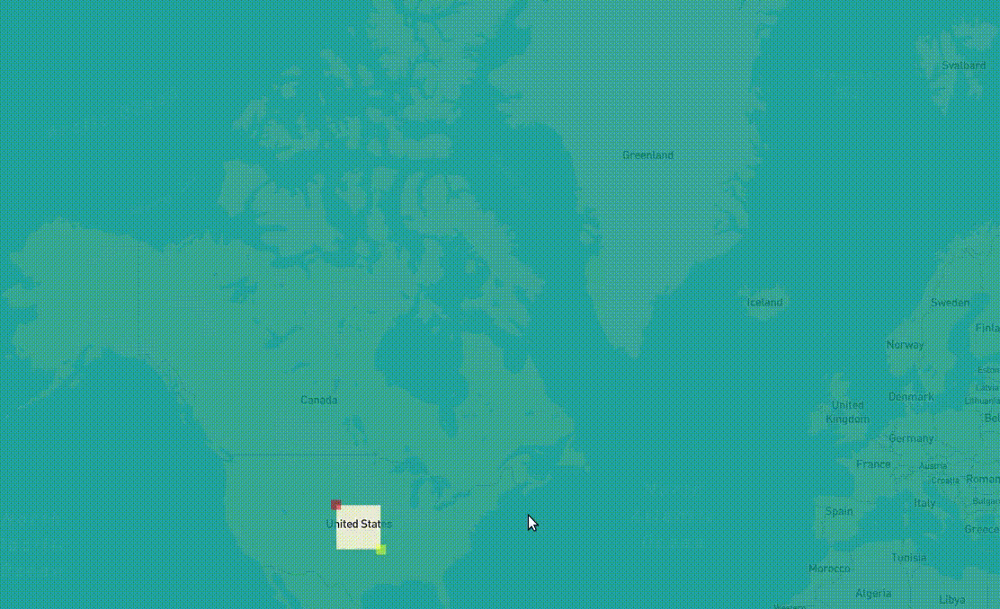
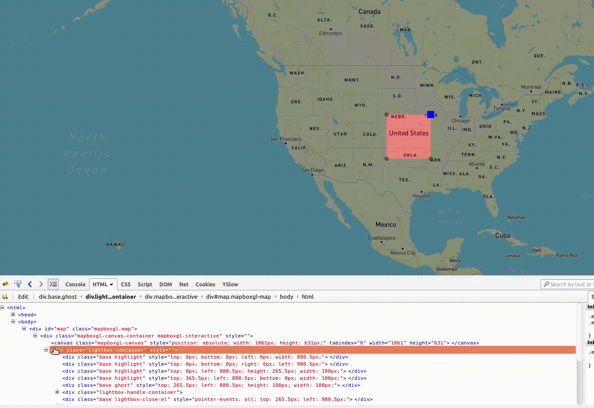
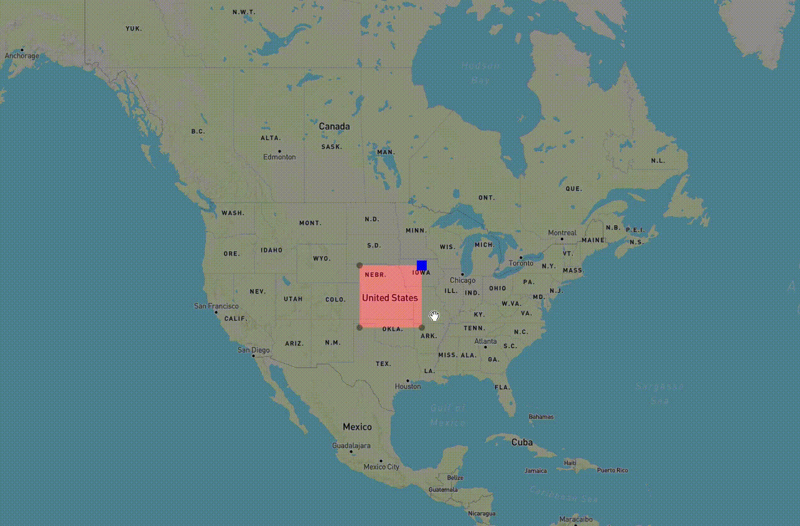

# Map Lightbox - an experiment 

I needed something that allowed me to highlight an area on a map. This highlight box had to be draggable and resizable.
Not having found anything similar I decided to build my own. This is an outline of the challenges I faced.

I'm using [Mapbox GL JS](https://www.mapbox.com/mapbox-gl-js/api/) for the map.

### You should not use this code
The code in these examples is not production ready, so I'd advise against using it. However feel free to get ideas from and improve it.

## First attempt: GeoJSON

The [first attempt](https://danielfdsilva.github.io/map-lightbox-experiment/geojson.html) used a polygon. Basically the whole map gets covered by it except the area to highlight.

There were a couple of problems with this approach:
  - Having to calculate and redraw a polygon every time is resource intensive so performance is not very good.
  - I was using the difference between the previous and current coordinates to calculate the box movement. This leads to the box size changing because of the projection.

## Second attempt: GeoJSON with pixels

The [second attempt](https://danielfdsilva.github.io/map-lightbox-experiment/geojsonpx.html) was built on top of the first so it still uses a polygon and the same technique. However in this case the calculation is being done with pixels so the box size does not change. Performance is still an issue.

With this attempt the drag handles were added and this raised another problem.
Since the polygon is bound to the map by the coordinates, when zooming in its apparent size changes but the covered area stays the same.
This behavior, although good for the highlight box, is not desirable for the handles. Handles should stay the same size regardless of zoom level so on every zoom change their size had to be computed again.

## Third attempt: DOM elements

[Third time's the charm](https://danielfdsilva.github.io/map-lightbox-experiment/domel.html). This approach uses DOM elements to build the highlight box. Four `div` elements are added on top of the map to make the shadow part, and another for the actual "box".

This approach requires a lot more calculations because every div's position and size has to be updated, and coordinates have to be translated to pixels and vice versa. Nevertheless this is by far the most performant solution, having almost no noticeable delays.

Constantly dealing with pixel positions and sizes causes the opposite problem of the previous example. In this case the box was maintaining its size on zoom, which is not the desirable behavior because the highlight area was changing. This is easily solvable by recomputing the box size once the zoom changes.

Currently all the events (`mousedown`, `mousemove`, `mouseup`, `map-move`, `map-zoom`) are being added to the map. Then depending on the mouse position different actions are triggered. For example, if the mouse is in the area taken up by an handle dragging is allowed. Since DOM elements support events, some could be added to the elements instead possibly saving some calculations.
